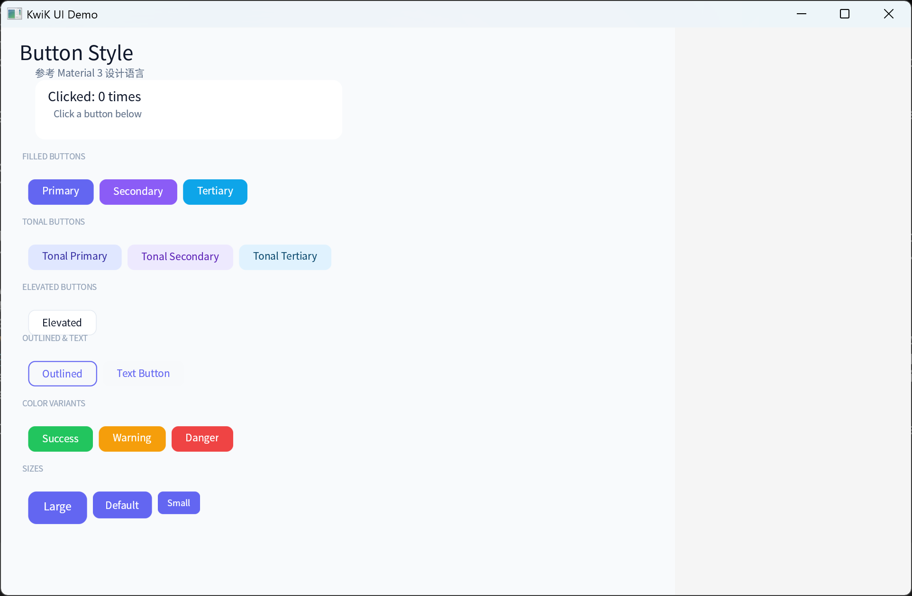
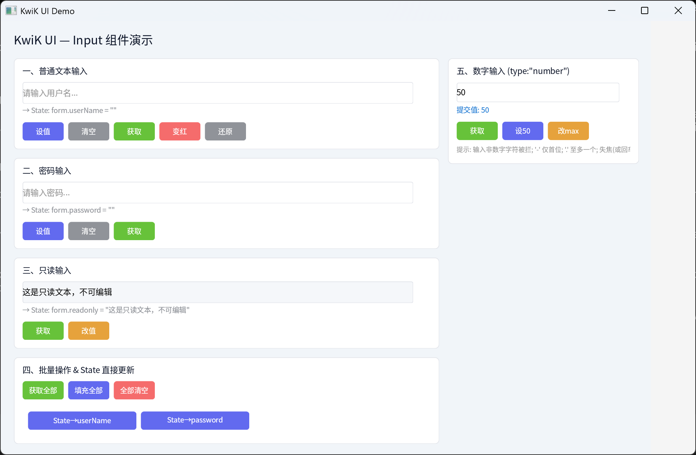
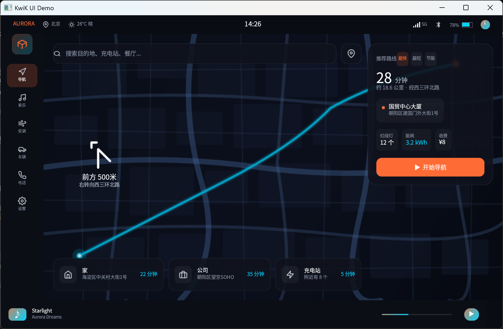
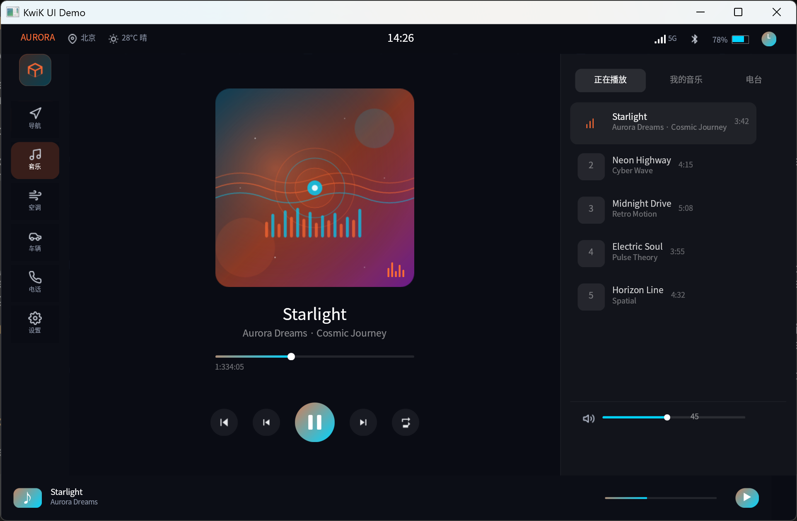
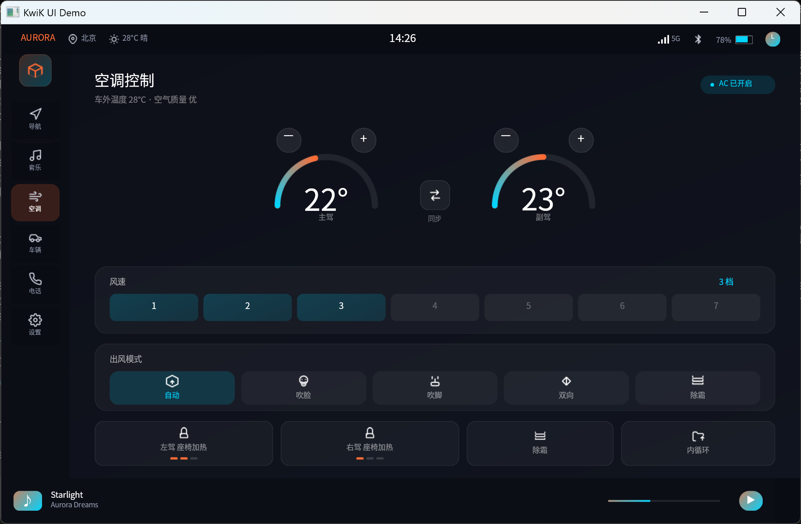
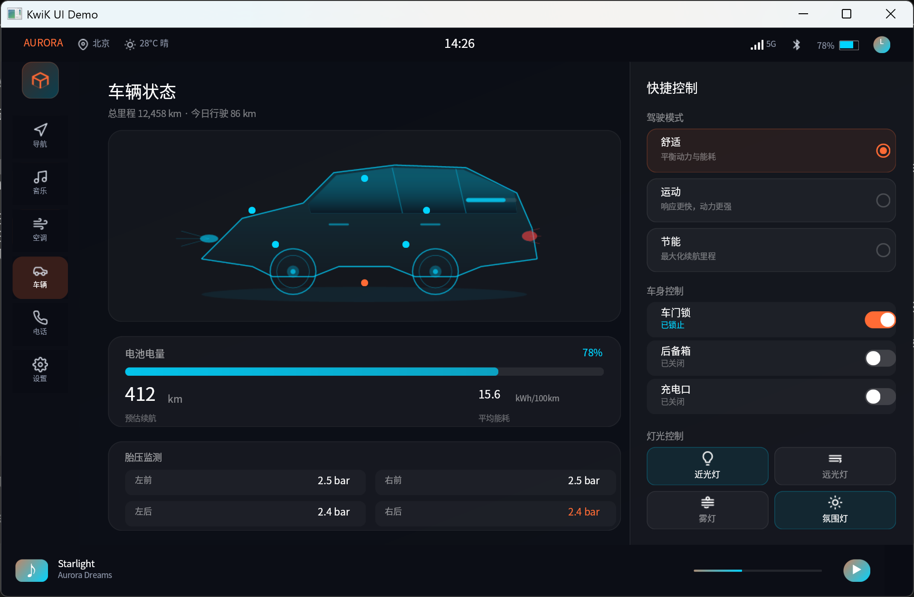
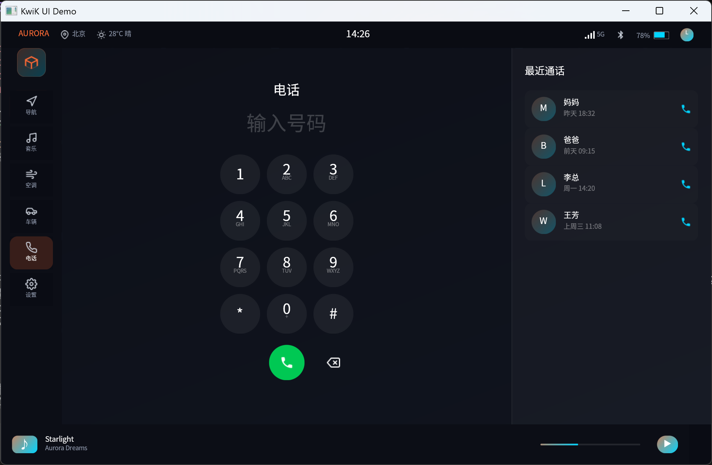
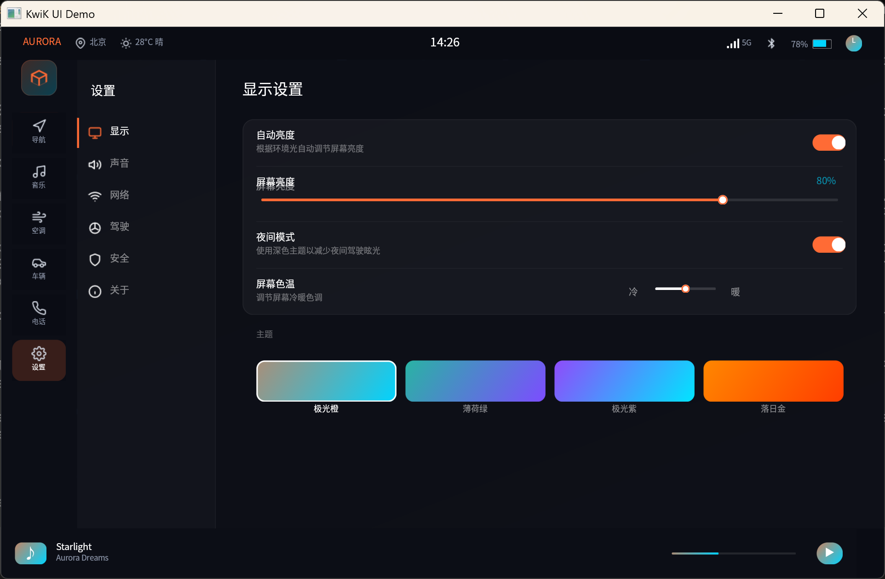
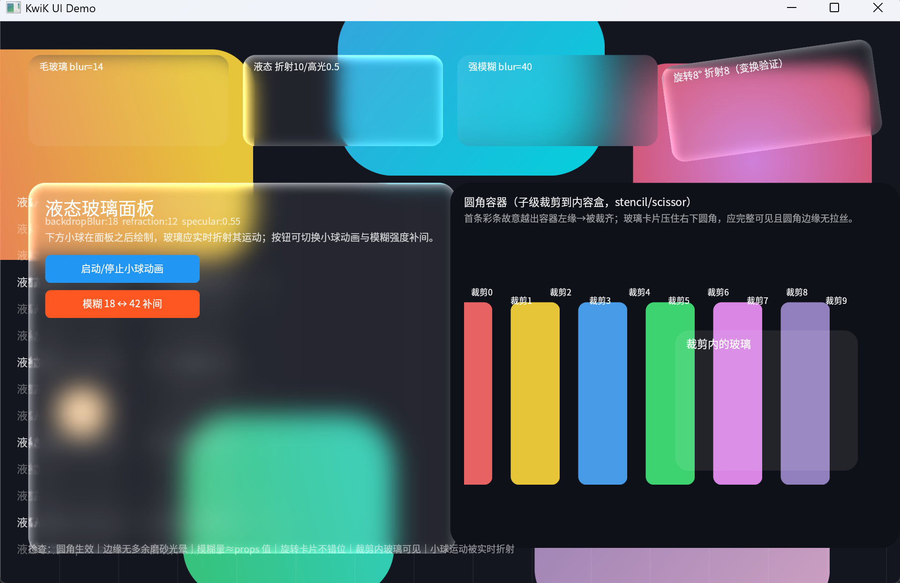
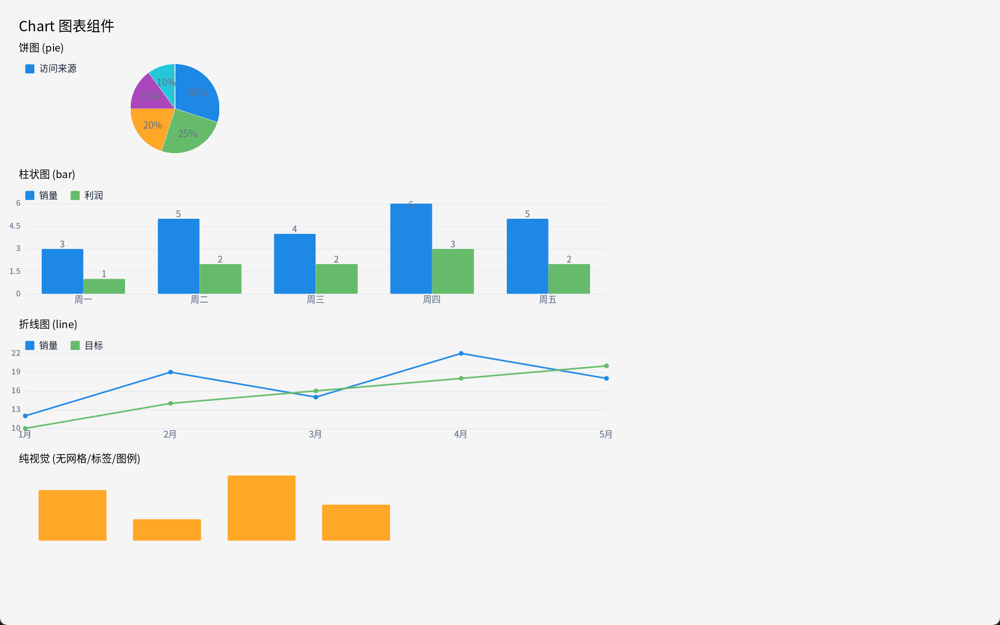

<div align="center">
<h1>kwik-ui (C++ Declarative UI Library)</h1>
<p>English | <a href="README.md">简体中文</a></p>
</div>

<p align="center">


</p>

# 1. Project Description
- A declarative cross-platform UI framework built on C++26 Modules, QuickJS, and Vulkan. Vulkan provides GPU hardware-accelerated rendering while QuickJS drives a JS-declared component tree, delivering a high-performance, low-latency native UI experience. A low-overhead C++ core combined with flexible JS logic — suited for embedded Linux and cross-platform application development.
- Both Debug and Release modes are supported, selected via the `enableHotReload` configuration:
    - Debug: hot reload of UI files with live preview
    - Release: UI files are compiled to bytecode and embedded in the executable — a single-executable distribution with no runtime file parsing, performance on par with native C++.

# 2. Development Environment
- IDE: VSCode
    - Plugins: clangd, CMake, CMake Tools
- OS: Windows 11
- Compiler: llvm-mingw-20260421-ucrt-x86_64
- Build system: CMake 4.3.2
- Build tool: Ninja 1.13.2

# 3. Showcase
## 3.1 Code Example
```
import { View, Text, Button, Input, TextArea, Checkbox, Flex, State, Root, ref, getProp, setProp } from 'kwikui';

const profile = new State({
    name: "张三",
    bio: "",
    agree: false
});

export default () => Root(
    View({
        background: "#f5f5f5",
        padding: 24
    }, [
        Text({ text: "用户信息", fontSize: 24, color: "#333", margin: [0, 0, 24, 0] }),
        Text({ text: `姓名: ${profile.name}`, fontSize: 16, color: "#666" }),
        Input({
            id: "inputName",
            value: ref(profile, "name"),
            placeholder: "请输入姓名",
            width: 320, height: 40,
            margin: [0, 0, 20, 0]
        }),

        Text({ text: `简介: ${profile.bio || "(空)"}`, fontSize: 16, color: "#666" }),
        TextArea({
            id: "inputBio",
            value: ref(profile, "bio"),
            placeholder: "请输入个人简介",
            rows: 3, width: 320,
            margin: [0, 0, 20, 0]
        }),

        Checkbox({ id: "chkAgree", text: "同意用户协议", checked: ref(profile, "agree") }),
        Text({
            text: `协议: ${profile.agree ? "✓ 已同意" : "✗ 未同意"}`,
            fontSize: 14, color: "#999",
            margin: [0, 0, 24, 0]
        }),

        Flex({ direction: "row", gap: 12, margin: [0, 0, 12, 0] }, [
            Button({
                text: "打印姓名", width: 100, height: 36,
                onClick: () => console.log("profile.name:", profile.name)
            }),
            Button({
                text: "打印简介", width: 100, height: 36,
                onClick: () => console.log("profile.bio:", profile.bio)
            }),
            Button({
                text: "打印协议", width: 100, height: 36,
                onClick: () => console.log("profile.agree:", profile.agree)
            }),
            Button({
                text: "清空", width: 100, height: 36, background: "#ff9800",
                onClick: () => { profile.name = ""; profile.bio = ""; profile.agree = false; }
            }),
            Button({
                text: "快速填写", width: 120, height: 36, background: "#34a853",
                onClick: () => { profile.name = "李四"; profile.bio = "C++ 全栈开发\n5 年经验"; profile.agree = true; }
            }),
        ]),

        Flex({ direction: "row", gap: 12 }, [
            Button({
                text: "get 姓名", width: 100, height: 36, background: "#4285f4",
                onClick: () => console.log("getProp name:", getProp("inputName", "value"))
            }),
            Button({
                text: "get 简介", width: 100, height: 36, background: "#4285f4",
                onClick: () => console.log("getProp bio:", getProp("inputBio", "value"))
            }),
            Button({
                text: "get 协议", width: 100, height: 36, background: "#4285f4",
                onClick: () => console.log("getProp agree:", getProp("chkAgree", "checked"))
            }),
            Button({
                text: "set 姓名→王五", width: 140, height: 36, background: "#9c27b0",
                onClick: () => setProp("inputName", "value", "王五")
            }),
            Button({
                text: "set 简介→测试", width: 140, height: 36, background: "#9c27b0",
                onClick: () => setProp("inputBio", "value", "测试内容\n第二行")
            }),
        ]),
    ])
);
```

## 3.2 Screenshots

<table>
  <tr>
    <td></td>
    <td></td>
  </tr>
</table>

<table>
  <tr>
    <td></td>
    <td></td>
  </tr>
</table>

<table>
  <tr>
    <td></td>
    <td></td>
  </tr>
</table>

<table>
  <tr>
    <td></td>
    <td></td>
  </tr>
</table>

<table>
  <tr>
    <td></td>
    <td></td>
  </tr>
</table>

- More examples: [examples/](examples/)
- Component reference: [docs/1.kwik-ui 组件.md](docs/1.kwik-ui%20组件.md) (Chinese)

## 3.3 Channel Communication Example

Channel provides bidirectional communication between JS and C++, supporting both one-way notifications and request-response patterns (see [docs/2. State和channel.md](docs/2.%20State和channel.md), Chinese).

**JS side:**
```js
import { channel } from 'kwikui';

// ① Notify C++ (fire-and-forget, no return value)
channel.send('button_click', { id: Date.now() });

// ② Receive notifications from C++
channel.on('sensor:temp', function(data) {
    console.log('temperature sensor:', data);
});

// ③ Call a C++ handler (returns a Promise)
const result = await channel.call('get_config', { key: 'theme' });
console.log('config:', result);  // "dark_theme"
```
**C++ side (examples/example.cpp):**
```c++
// Send a notification to JS (thread-safe)
Channel::send("sensor:temp", "temp:25.3,humidity:68.5");

// ── ① Notification: JS → C++ ──
Channel::on("button_click",
            [](const Channel::Data &d) { Log::info("[notify] JS → C++ send 'button_click': {}", d.asString()); });

// ── ② Synchronous call ──
Channel::handle("get_config", [](const Channel::Data &d) -> Channel::Data {
    Log::info("[sync] JS → C++ call 'get_config': {}", d.asString());
    return Channel::Data("dark_theme");
});

// ── ③ Async call on a worker thread ──
Channel::handle("start_download", [](const Channel::Data &d, auto respond) {
    Log::info("[worker thread] JS → C++ call 'start_download': {}", d.asString());
    std::thread([d, respond] {
        std::this_thread::sleep_for(std::chrono::milliseconds(500));
        Channel::getMainThreadQueue().post(
            [respond, result = std::string(d.asString())] { respond(Channel::Data("Downloaded: " + result)); });
    }).detach();
});

// ── ④ Async coroutine call ──
Channel::handle("process_file", [](const Channel::Data &d) -> Channel::CoroTask {
    Log::info("[coroutine] JS → C++ call 'process_file': {}", d.asString());
    Channel::Data dataCopy = d;    // ← copy before co_await; the coroutine frame owns this copy
    co_await Channel::thread_pool();
    std::this_thread::sleep_for(std::chrono::milliseconds(100));
    std::string content = "Processed: " + std::string(dataCopy.asString());
    co_await Channel::main_thread();
    co_return Channel::Data(content);
});
```

# 4. Build & Install
## 4.1 Prerequisites

| Dependency | Minimum Version |
|---|---|
| CMake | 4.3.2 |
| Ninja | 1.13 |
| Toolchain | llvm-mingw-20260421-ucrt-x86_64 (or Clang ≥ 18, with C++ Modules support) |
| Vulkan SDK | 1.3 (optional; a stub target is created if not found) |

## 4.2 Building the Project
```
cmake -DCMAKE_BUILD_TYPE:STRING=Debug 
-DCMAKE_EXPORT_COMPILE_COMMANDS:BOOL=TRUE 
-DCMAKE_C_COMPILER:FILEPATH=C:\software\llvm-mingw\bin\clang.exe 
-DCMAKE_CXX_COMPILER:FILEPATH=C:\software\llvm-mingw\bin\clang++.exe 
--no-warn-unused-cli 
-S C:/ws-code/ws-kwik/kwik-ui 
-B c:/ws-code/ws-kwik/kwik-ui/build 
-G Ninja 
&& cmake --build build --config Debug --target all
```
## 4.3 Installing the SDK
```
cmake --install build --prefix build/install
```
## 4.4 Creating a New Project

```bash
Reference project: examples\external\
Build:             examples\external\build.bat
```

## 4.5 Testing

```bash
# Unit tests (pure logic, no window/GPU required; equivalent to cd build && ctest)
./test/kwik_unit_tests

# Smoke tests (run from the build/test directory): runs each example for N frames,
# auto-exits, and scans the output for errors
cd build/test
python ../../test/tools/smoke.py                    # all 38 examples, 40 frames each by default
python ../../test/tools/smoke.py glass layer car    # only the named examples
python ../../test/tools/smoke.py --frames 400       # longer runs (stress-tests animation paths)
python ../../test/tools/smoke.py --validation       # enable Vulkan validation layers to catch spec violations

# Manually run a single example (normal window, for visual inspection)
./example.exe glass
```

- Pass criteria: exit code 0 (in smoke mode this equals the Log error count) and no `[Error]` / `Assertion` / `DEVICE_LOST` in the output
- The environment variable `KWIK_VALIDATION=1/0` force-enables/disables the validation layers (`--validation` is a wrapper around this)
