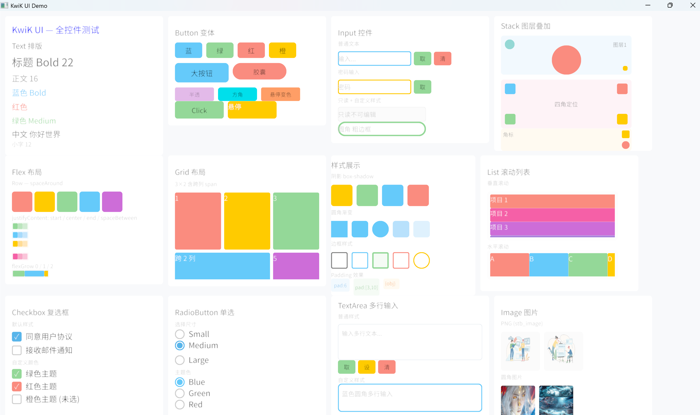

<div align="center">
<h1>kwik-ui(c++ 声明式UI库)</h1>
</div>

<p align="center">


</p>

# 1. 项目描述
基于 C++26 Modules、QuickJS 与 Vulkan 的声明式跨平台 UI 框架。Vulkan GPU 硬件加速渲染，QuickJS 驱动 JS 声明组件树，实现高性能、低延迟的原生 UI 体验。低开销 C++ 内核 + 灵活 JS 逻辑，适用于嵌入式 Linux 及跨平台应用开发。

# 2. 开发环境
- IDE: VSCODE
    - 插件： clangd, CMake, CMake Tools, opencode
- 操作系统： Windows11
- 编译器： llvm-mingw-20260421-ucrt-x86_64
- 构建系统： cmake 4.3.2
- 构建工具： ninja 1.13.2

# 3. 项目效果展示
## 3.1 代码示例
```
import { View, Text, Button, Input, TextArea, Checkbox,
         Flex, State, ref, getProp, setProp } from 'kwikui';

const profile = new State({
    name: "张三",
    bio: "",
    agree: false
});

export default () => View({
    width: 800,
    height: 600,
    background: "#f5f5f5",
    padding: 24
}, [
    // ══════════════════════════════════════════════
    // 标题
    // ══════════════════════════════════════════════
    Text({ text: "用户信息", fontSize: 24, color: "#333", margin: [0, 0, 24, 0] }),

    // ══════════════════════════════════════════════
    // 姓名
    // ══════════════════════════════════════════════
    Text({ text: `姓名: ${profile.name}`, fontSize: 16, color: "#666" }),
    Input({
        id: "inputName",
        value: ref(profile, "name"),
        placeholder: "请输入姓名",
        width: 320, height: 40,
        margin: [0, 0, 20, 0]
    }),

    // ══════════════════════════════════════════════
    // 个人简介
    // ══════════════════════════════════════════════
    Text({ text: `简介: ${profile.bio || "(空)"}`, fontSize: 16, color: "#666" }),
    TextArea({
        id: "inputBio",
        value: ref(profile, "bio"),
        placeholder: "请输入个人简介",
        rows: 3, width: 320,
        margin: [0, 0, 20, 0]
    }),

    // ══════════════════════════════════════════════
    // 协议
    // ══════════════════════════════════════════════
    Checkbox({ id: "chkAgree", text: "同意用户协议", checked: ref(profile, "agree") }),
    Text({
        text: `协议: ${profile.agree ? "✓ 已同意" : "✗ 未同意"}`,
        fontSize: 14, color: "#999",
        margin: [0, 0, 24, 0]
    }),

    // ══════════════════════════════════════════════
    // 操作按钮 — 第 1 行：State 操作
    // ══════════════════════════════════════════════
    Flex({ direction: "row", gap: 12, margin: [0, 0, 12, 0] }, [
        Button({
            text: "打印姓名", width: 100, height: 36,
            onClick: () => console.log("profile.name:", profile.name)
        }),
        Button({
            text: "打印简介", width: 100, height: 36,
            onClick: () => console.log("profile.bio:", profile.bio)
        }),
        Button({
            text: "打印协议", width: 100, height: 36,
            onClick: () => console.log("profile.agree:", profile.agree)
        }),
        Button({
            text: "清空", width: 100, height: 36, background: "#ff9800",
            onClick: () => { profile.name = ""; profile.bio = ""; profile.agree = false; }
        }),
        Button({
            text: "快速填写", width: 120, height: 36, background: "#34a853",
            onClick: () => { profile.name = "李四"; profile.bio = "C++ 全栈开发\n5 年经验"; profile.agree = true; }
        }),
    ]),

    // ══════════════════════════════════════════════
    // 操作按钮 — 第 2 行：getProp / setProp
    // ══════════════════════════════════════════════
    Flex({ direction: "row", gap: 12 }, [
        Button({
            text: "get 姓名", width: 100, height: 36, background: "#4285f4",
            onClick: () => console.log("getProp name:", getProp("inputName", "value"))
        }),
        Button({
            text: "get 简介", width: 100, height: 36, background: "#4285f4",
            onClick: () => console.log("getProp bio:", getProp("inputBio", "value"))
        }),
        Button({
            text: "get 协议", width: 100, height: 36, background: "#4285f4",
            onClick: () => console.log("getProp agree:", getProp("chkAgree", "checked"))
        }),
        Button({
            text: "set 姓名→王五", width: 140, height: 36, background: "#9c27b0",
            onClick: () => setProp("inputName", "value", "王五")
        }),
        Button({
            text: "set 简介→测试", width: 140, height: 36, background: "#9c27b0",
            onClick: () => setProp("inputBio", "value", "测试内容\n第二行")
        }),
    ]),
]);
```
## 3.2 效果示例

- 更多示例可参考:  examples/
- 更多组件相关参考:  doc/1.kwik-ui 组件.md

## 3.3 Channel 通信示例

Channel 提供 JS 与 C++ 之间的双向通信，支持单向通知和请求-响应两种模式（详见 `doc/2. State和channel.md`）。

**JS 端：**
```js
import { channel } from 'kwikui';

// ① 通知 C++（发后即忘，无返回值）
channel.send('button_click', { id: Date.now() });

// ② 接收 C++ 通知
channel.on('sensor:temp', function(data) {
    console.log('温度传感器:', data);
});

// ③ 调用 C++ handler（返回 Promise）
const result = await channel.call('get_config', { key: 'theme' });
console.log('配置:', result);  // "dark_theme"
```
**C++ 端（examples/example.cpp）：**
```c++
// 发送通知到 JS（线程安全）
Channel::send("sensor:temp", "temp:25.3,humidity:68.5");

// ── ① 通知: JS → C++ ──
Channel::on("button_click",
            [](const Channel::Data &d) { Log::info("[通知] JS → C++ send 'button_click': {}", d.asString()); });

// ── ② 同步调用 ──
Channel::handle("get_config", [](const Channel::Data &d) -> Channel::Data {
    Log::info("[同步] JS → C++ call 'get_config': {}", d.asString());
    return Channel::Data("dark_theme");
});

// ── ③ 异步线程调用 ──
Channel::handle("start_download", [](const Channel::Data &d, auto respond) {
    Log::info("[异步线程] JS → C++ call 'start_download': {}", d.asString());
    std::thread([d, respond] {
        std::this_thread::sleep_for(std::chrono::milliseconds(500));
        Channel::getMainThreadQueue().post(
            [respond, result = std::string(d.asString())] { respond(Channel::Data("Downloaded: " + result)); });
    }).detach();
});

// ── ④ 异步协程调用 ──
Channel::handle("process_file", [](const Channel::Data &d) -> Channel::CoroTask {
    Log::info("[协程] JS → C++ call 'process_file': {}", d.asString());
    Channel::Data dataCopy = d;    // ← 在 co_await 之前复制，协程帧拥有此副本
    co_await Channel::thread_pool();
    std::this_thread::sleep_for(std::chrono::milliseconds(100));
    std::string content = "Processed: " + std::string(dataCopy.asString());
    co_await Channel::main_thread();
    co_return Channel::Data(content);
});
```

# 4. 运行和安装
## 4.1 前置依赖

| 依赖 | 最低版本 |
|---|---|
| CMake | 4.3.2 |
| Ninja | 1.13 |
| 编译器 | llvm-mingw-20260421-ucrt-x86_64 (或 Clang ≥ 18，需支持 C++26 Modules) |
| Vulkan SDK | 1.3 (可选，找不到则创建 stub target) |

## 4.2 工程编译
```
cmake -DCMAKE_BUILD_TYPE:STRING=Debug 
-DCMAKE_EXPORT_COMPILE_COMMANDS:BOOL=TRUE 
-DCMAKE_C_COMPILER:FILEPATH=C:\software\llvm-mingw\bin\clang.exe 
-DCMAKE_CXX_COMPILER:FILEPATH=C:\software\llvm-mingw\bin\clang++.exe 
--no-warn-unused-cli 
-S C:/ws-code/ws-kwik/kwik-ui 
-B c:/ws-code/ws-kwik/kwik-ui/build 
-G Ninja 
&& cmake --build build --config Debug --target all
```
## 4.3 安装 SDK
```
cmake --install build --prefix build/install
```
## 4.4 新建工程

```bash
工程参考：examples\external\
构建： examples\external\build.bat
```
